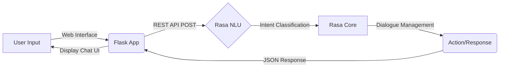

<div align="center">
  <h1>🎯 Quotes Recommendation Chatbot Using NLP</h1>

  <p>
    <i>An intelligent conversational AI system built with Rasa NLU, providing personalized quote recommendations for motivation, success, love, and more.</i>
  </p>

  <!-- GitHub Badges -->
  <p>
    <a href="https://github.com/ITZ-NIHALPATEL/QUOTES-RECOMMENDATION-CHATBOT-USING-NLP/stargazers"></a>
    <a href="https://github.com/ITZ-NIHALPATEL/QUOTES-RECOMMENDATION-CHATBOT-USING-NLP/network/members"></a>
    <a href="https://github.com/ITZ-NIHALPATEL/QUOTES-RECOMMENDATION-CHATBOT-USING-NLP"></a>
    <a href="https://github.com/ITZ-NIHALPATEL/QUOTES-RECOMMENDATION-CHATBOT-USING-NLP/issues"></a>
    <a href="https://github.com/ITZ-NIHALPATEL/QUOTES-RECOMMENDATION-CHATBOT-USING-NLP/blob/main/LICENSE"></a>
    <a href="https://github.com/ITZ-NIHALPATEL/QUOTES-RECOMMENDATION-CHATBOT-USING-NLP/commits/main"></a>
    
  </p>

  <!-- Tech Stack Badges -->
  <p>
    
    
    
    
    
    
    
    
  </p>

  <h4>
    <a href="https://quotes-frontend-939930549708.asia-south1.run.app" target="_blank" rel="noopener noreferrer">View Live Demo</a>
    <span> · </span>
    <a href="https://github.com/ITZ-NIHALPATEL/QUOTES-RECOMMENDATION-CHATBOT-USING-NLP/issues">Report Bug</a>
    <span> · </span>
    <a href="https://github.com/ITZ-NIHALPATEL/QUOTES-RECOMMENDATION-CHATBOT-USING-NLP/issues">Request Feature</a>
  </h4>
</div>

---

## 🌐 Live Demo / Deployment

Experience the conversational AI chatbot live natively deployed via Google Cloud Run:

<p>
  <a href="https://quotes-frontend-939930549708.asia-south1.run.app" target="_blank" rel="noopener noreferrer">
    
  </a>
</p>

---

## 📌 Project Overview

The **Quotes Recommendation Chatbot** is a dynamic, intent-driven conversational AI application designed to support mental well-being and provide instant emotional boosts. By understanding natural language inputs through **Rasa NLU**, the chatbot predicts the user's intent and curates highly relevant quotes through an interactive conversation.

Built to demonstrate a full-stack, end-to-end implementation of Natural Language Processing and web technologies, the chatbot exposes a seamless REST API mapped to an interactive Flask-based chat UI. It provides intelligent, real-time, and context-aware quote recommendations through a beautifully designed interface.

---

## 🚀 Features

- **✅ Intent Recognition:** Powered by Rasa NLU for accurate language understanding.
- **✅ Dialogue Management:** Seamless conversation flows managed by Rasa Core.
- **✅ Multiple Quote Categories:**
  - Motivation 🌟
  - Inspiration 💡
  - Love ❤️
  - Success 🏆
  - Funny 😂
- **✅ Interactive Feedback System:** Tailors responses based on user satisfaction.
- **✅ Fallback Handling:** Gracefully handles unrecognized inputs.
- **✅ Dynamic Category Selection:** Intuitive routing for the "Not Satisfied" flow.
- **✅ Web-based Interface:** Developed with Flask and custom frontend styling for a rich UI.
- **✅ REST API Integration:** Smooth communication between frontend elements and Rasa backend.
- **✅ Cloud Native:** Built with Docker and scalable via Google Cloud Run.

<details>
<summary><b>Click for Business Impact Details</b></summary>
<br>
<ul>
    <li>Promotes mental well-being and provides instant motivational support.</li>
    <li>Enhances user engagement and demonstrates practical NLP application.</li>
    <li>Highly scalable implementation compatible with wellness, education, and customer-service sectors.</li>
</ul>
</details>

---

## 🛠️ Tech Stack

<div align="center">

| Component | Technology | Description |
| :--- | :--- | :--- |
| **Backend & AI** |  <br/>  | Python 3.8 powering Rasa NLU and Core logic |
| **Server/API** |  <br/>  | Flask web framework and Docker Containerization |
| **Frontend** |  <br/>  <br/>  | HTML, CSS, JavaScript for end-user web interface |

</div>

---

## 🏗️ Architecture / Workflow

The basic communication lifecycle of the chatbot operates as follows:



<details>
<summary><b>View Development Epics</b></summary>
<br>

1. **Environment & Scope:** Defined needs, setup Rasa, Virtual Env.
2. **Model Building:** Built `nlu.yml` (intents), `domain.yml` (responses), `stories.yml` (flows), `rules.yml`.
3. **Training & API Integration:** Tested in Rasa Shell → enabled REST API.
4. **Full-Stack Deployment:** Integrated UI templates via Flask, deployed via Cloud Run.
</details>

---

## 📸 Screenshots

Here's a glimpse of the chatbot integration and its conversational flows:

<div align="center">
  
|  |  |
| :---: | :---: |
| *Chat Initialization* | *Quote Recommendation Flow* |

|  |  |
| :---: | :---: |
| *Category Selection* | *Fallback Handling* |

|  |  |
| :---: | :---: |
| *Feedback Loop* | *Session Wrap-up* |

</div>

---

## ⚙️ Installation

To set up the project on your local machine, naturally run the following steps:

```bash
# 1. Clone the repository
git clone https://github.com/ITZ-NIHALPATEL/QUOTES-RECOMMENDATION-CHATBOT-USING-NLP.git
cd QUOTES-RECOMMENDATION-CHATBOT-USING-NLP

# 2. Create and activate a Virtual Environment
python -m venv venv
# On Windows
venv\Scripts\activate
# On Mac/Linux
source venv/bin/activate

# 3. Install required Dependencies
pip install -r requirements.txt
# (or if requirements.txt is missing: pip install rasa flask requests)
```

---

## 💻 Running the Project Locally

To run the full stack locally, you need two terminal windows:

### Terminal 1: Rasa Server (Backend API)
Train (if you haven't yet) and start the Rasa server exposing the REST API:
```bash
# Train the model (Outputs to models/ )
rasa train

# Run the backend REST API
rasa run --enable-api --cors "*"
```

### Terminal 2: Flask Server (Frontend UI)
Start the frontend server which connects to your Rasa backend interactions.
```bash
python app.py
```

Then, open your browser and navigate to: 👉 `http://127.0.0.1:5000`

*(CLI Testing Tip: To test directly via the terminal without the web UI, just run `rasa shell`)*

---

## ☁️ Deployment (Google Cloud Run)

This project has been Dockerized and deployed via Google Cloud Run for scalability.

<details>
<summary><b>View Deployment Steps</b></summary>
<br>

**1. Build the Docker Image:**
```bash
docker build -t gcr.io/[PROJECT_ID]/rasa-quotes-bot:latest .
```

**2. Push to Container Registry:**
```bash
docker push gcr.io/[PROJECT_ID]/rasa-quotes-bot:latest
```

**3. Deploy to Cloud Run:**
```bash
gcloud run deploy quotes-chatbot \
  --image gcr.io/[PROJECT_ID]/rasa-quotes-bot:latest \
  --platform managed \
  --region asia-south1 \
  --allow-unauthenticated
```
</details>

---

## 📂 Project Structure

```text
📦 QUOTES RECOMMENDATION CHATBOT USING NLP
 ┣ 📂 actions/             # Custom Rasa action scripts
 ┣ 📂 data/
 ┃ ┣ 📜 nlu.yml            # Intent definitions and training data
 ┃ ┣ 📜 rules.yml          # Enforced logic paths
 ┃ ┗ 📜 stories.yml        # Dialogue conversational flows
 ┣ 📂 models/              # Saved trained machine learning models
 ┣ 📂 screenshots/         # Portfolio presentation graphics
 ┣ 📂 templates/
 ┃ ┗ 📜 index.html         # Web frontend UI structure
 ┣ 📜 app.py               # Flask application server
 ┣ 📜 config.yml           # NLU pipeline and Core policy configs
 ┣ 📜 credentials.yml      # Authentication for channels (REST configured)
 ┣ 📜 domain.yml           # Complete chatbot universe (intents, responses)
 ┣ 📜 endpoints.yml        # Webhook routing configurations
 ┣ 📜 Dockerfile           # Backend containerization instructions
 ┗ 📜 README.md            # Entry documentation
```

---

## 🤝 Contributing

Contributions are what make the open source community such an amazing place to learn, inspire, and create. Any contributions you make are **greatly appreciated**.

1. Fork the Project
2. Create your Feature Branch (`git checkout -b feature/AmazingFeature`)
3. Commit your Changes (`git commit -m 'Add some AmazingFeature'`)
4. Push to the Branch (`git push origin feature/AmazingFeature`)
5. Open a Pull Request

---

## 🔮 Future Improvements

- 🎭 **Emotion Detection:** Implement sentiment analysis natively to decide the quote.
- 📱 **Social Media Integration:** Map endpoints to connect directly to Telegram / WhatsApp.
- 🗣️ **Voice-based Interaction:** Voice-to-Text and Text-to-Voice implementation.
- 🧠 **Transformer Enhancements:** Incorporate BERT-based intent architectures.
- 🌐 **Dynamic APIs:** Fetching live quotes from third-party Quote APIs for unlimited variety.

---

## 📜 License

This project is developed for academic and educational purposes. Ensure to comply with all standard source constraints.

---

## 👨‍💻 Author

**Nihal Patel**  
Developed as an interactive portfolio project highlighting modern Conversational AI techniques, Web integration, and Cloud scalable deployments.  
👉 [Follow on GitHub](https://github.com/ITZ-NIHALPATEL)

---

> _Developed for educational and portfolio demonstration purposes._
